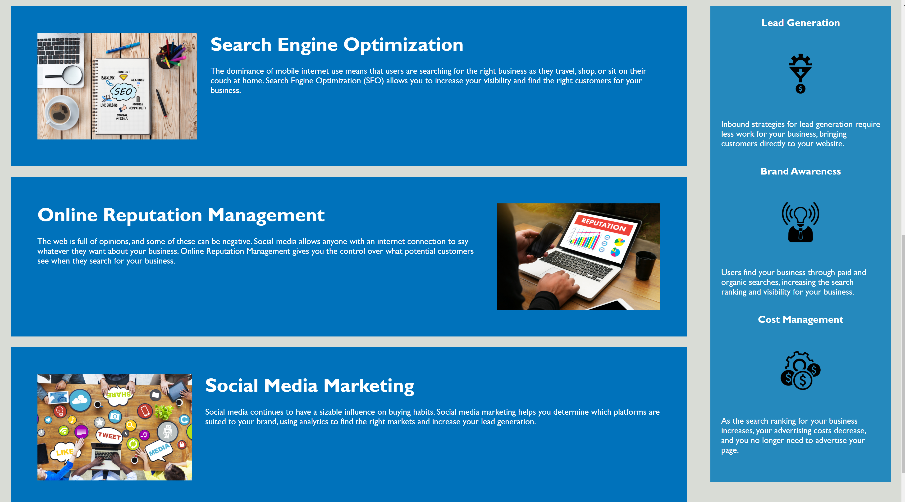

# Horiseon Website Update
> This is a fist assignment in the UTCoding Bootcamp.  The purpose was to cement basic HTML and CSS skills by refactoring a website for a fictious company Horiseon. 

## Table of contents
* [General info](#general-info) 
* [Screenshots](#screenshots)
* [Technologies](#technologies) 
* [Setup](#setup)
* [Features](#features)
* [Status](#status)
* [Inspiration](#inspiration)
* [Contact](#contact)

## General info
According to the assignment prompt: 
> As a marketing agency I want a database that follows accessibility standards so that our own site is optimized for search engines.

## Screenshots

## Technologies
* HTML5
* CSS#

## Setup
`$ cd ..
$ code index.html`

## Code Examples

`    <!-- start benefits -->
    

        

            <h3>Lead Generation</h3>
            
            

                Inbound strategies for lead generation require less work for your business, bringing customers directly to your website.
            

        

        

            <h3>Brand Awareness</h3>
            
            

                Users find your business through paid and organic searches, increasing the search ranking and visibility for your business.
            

        

        

            <h3>Cost Management</h3>
            
            

                As the search ranking for your business increases, your advertising costs decrease, and you no longer need to advertise your page.
            

        

    

    <!-- end benefits -->

`

## Features
List of features ready and TODOs for future development
* Accessibility
    - added ADA conforming descriptions to images
    - semantic tags were added to both the HTML and CSS codes to improve readablity
* Consolidation
    - removed redunancy in the HTML and CSS codes while maintaining full functionality of the site
    - reordered the HTML and CSS codes so they mirror each other and thus improve their flow
* Functionality
    - fixed links in the page to improve flow

To-do list:
* Optimize for mobile viewing
* Perhaps add some animation in the future

## Status
This project is still in progress.  This is the first "final product" that will probably have future improvements.

## Inspiration
This project and even more the jump into the world of programming is to learn new skills and enter a new technology field!

## Contact
Created by [@flynerdpl](https://www.flynerd.pl/) - feel free to contact me!